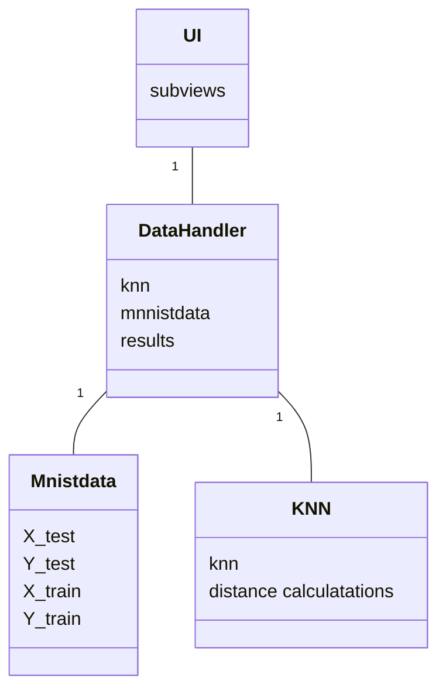

# Toteutusdokumentti

## Rakenne

### Luokkakaavio
Luokkakaavio kuvaa luokat periaatteellisella tasolla. Muuttujia eikä funktioita ei ole kuvattu tarkasti. 

### Käyttöliittymä
ks [manuaali](https://github.com/miahro/tiralabra-knn/blob/main/dokumentaatio/manuaali.md)

### Tietojen tallennus
Ohjelma lukee MNIST tietokannan http://yann.lecun.com/exdb/mnist/ ja tallentaa paikallisiin tiedostoihin. 

Laskennan tulokset tallennetaan .csv tiedostoon

### Käytetty tietorakenne
MNIST numeroiden luvun yhteydessä numerot tallennetaan seuraavaan tietorakenteeseen:
- 28 x 28 boolean matriisiin (False=valkoinen piste, True=musta piste)
- mustat pisteet lisäksy (x,y) pistelistana

### Algoritmien kuvaus
MNIST numerot pyritään tunnistamaan k:n lähimmän naapurin menetelmällä (KNN), käyttäen modifioituja Hausdorf-etäisyyksiä. Hausdorff etäisyyksien laskentaa on kuvattu lähteissä 1-3. 

Ohjelman (tällä hetkellä) käyttämä etäisyysmitta on lähinnä lähteen [3] mittaa D23. Kuitenkin tietyillä poikkeuksilla:
- euklidisen etäisyyden sijaan on käytetty neliöllistä etäisyyttä. Tämä on tehty laskenta-ajan säästämiseksi, ja koska KNN:lle oleellista on vain lähimpien naapureiden järjestys, antaa neliöllinen etäisyys täsmälleen saman tuloksen kuin euklidinen etäisyys
- suuntaamattoman etäisyytenä käytetään suunnattujen etäisyyksien summaa keskiarvon sijaan. Kuten edellisessä, tämä ei vaikuta KNN:n antamaan tulokseen

KNN algoritmi on toteutettu minimikekoa käyttäen.

Ohjelman aikavaativuuden määräävä tekijä on etäisyyksien laskeminen, koska jokaisen testinumeron etäisyys jokaiseen opetusnumeroon pitää laskea joka tapauksessa, ja tämä tarkoittaa, että jokaisen testinumeron jokaisen pisteen minimietäisyys käsiteltävästä opetusnumerosta pitää löytää. Toistoja on siis paljon: 10k testinumeroa, 60k opetusnumeroa, joissa jokaisessa luokkaa 100kpl pisteitä, riippuen käytetystä harmaafiltteristä). Etäisyyslaskentaa on siis pyritty optimoimaan:
- tämän vuoksi on vältetty funktiokutsuja, ja kaikki laskenta on KNN luokan prediction funktiossa. Funkio on näin liian pitkä, ja huonoa Python-tyyliä, mutta tämä on välttämätöntä tehokkuuden kannalta
- kuten yllä mainittu käytetty neliöllistä etäisyyttä euklidisen etäisyyden sijaan. KNN:ssä vain etäisyyksien järjestyksellä on väliä, jolloin tämä tuottaa saman tuloksen ilman neliöjuuren laskentaa
- pisteen ja pistejoukon etäisyyden laskennan nopeus on ratkaisevaa, tämän nopeuttamiseksi algoritmi toimii kolmessa vaiheessa:

1. Ensin tarkisteaan boolean matriisista, onko pistejoukossa päällekkäinen piste. Jos on, minimietäisyys on nolla, ja suoritus lopetetaan tähän. Muuten siirrytään kohtaan 2.
2. Seuraavaksi käydään läpi pistejoukon "lähellä" olevia pisteitä. 
- "lähellä" on tässä suhteellinen käsite, ja sitä kuvataan parametrilla "kerrokset" (koodissa layers). 
- riippuen kerrosten määrästä, on laskettu valmmiksi matriiseihin neliöllisiä etäisyyksiä pistettä lähellä olevista pisteistä. Nämä käydään läpi esijärjestetyssä listan mukaan. Lista esijärjestetty etäisyyksien minimien mukaan. Jos löydetään piste, etäisyys poimitaan valmiista matriisista, ja suoritus lopetetaan tähän. Jos pistettä ei löytynyt, siirrytään kohtaan 3. 
3. Tässä lasketaan raa'asti neliölliset etäisyydet pisteestä pistejoukon jokaiseen pisteeseen, ja haetaan näistä minimi

## Saavuttu aikavaativuus
Algoritmin aikavaativuus on O(MN), missä M on testidatan koko, ja N on opetusdatan koko. Tämä on ilmeistä, koska:
- KNN:ssä joudutaan joka tapauksessa laskemaan jokaisen testidatan etäisyys jokaiseen opetusdataan
- koska Hausdorff-etäisyydet on määritelty suuntaamattomina etäisyyksinä f(d(A,B), d(B,A)), joudutaan myös lasketaam jokaisen opetusdatapisteen etäisyys jokaiseen testidatapisteeseen. Kuitenkin tämä vain kaksinkertaistaa laskennan määrän, ei vaikuta O-aikavaativuuteen.

Käytetyssä algoritmissa O-aikavaativuudeen saavuttaminen ei ole vaikeaa, eikä sille toisaalta ole oikeastaan mitään tehtävissä. Aikavaativuuden optimoinnissa oleellista on etäisyyslaskennan vakioiden optimointi, jota on pyritty tekemään yllä kuvatuilla tavoilla. Tulokset esitetty tarkemmmin [testausdokumentissa](dokumentaatio/testaus.md).

## Puutteet ja parannusmahdollisuudet
- laskennan hitaus on suurin ongelma

## Lähteet
[1]Giuseppe Bonaccorso. Machine learning algorithms : popular algorithms for data science and machine learning. eng. Second edition. Birmingham ;
Packt Publishing, 2018. isbn: 1-78934-548-0.

[2]Giuseppe Bonaccorso. Mastering machine learning algorithms : expert techniques to implement popular machine learning algorithms and fine-tune your models. eng. 1st edition. Birmingham ; Packt, 2018. isbn: 1-78862-
590-0.

[3]M. Dubuisson ja A. Jain. ”A modified Hausdorff distance for object matc-
hing”. Teoksessa: Proceedings of 12th International Conference on Pattern
Recognition. Vol. 2. Los Alamitos, CA, USA: IEEE Computer Society, 1994,
s. 566,567,568. doi: 10.1109/ICPR.1994.576361. url: https://doi.
ieeecomputersociety.org/10.1109/ICPR.1994.576361.