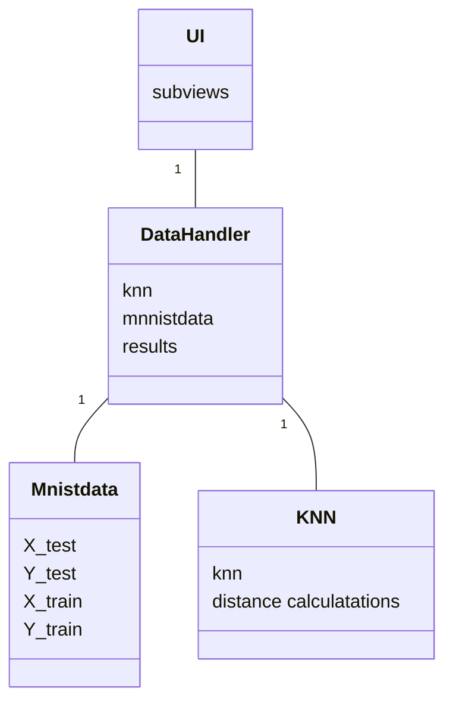

# Toteutusdokumentti

Hyvin keskeneräinen toteutusdokumentti

## Rakenne

### Luokkakaavio
Luokkakaavio kuvaa luokat periaatteellisella tasolla. Muuttujia eikä funktioita ei ole kuvattu tarkasti. 

### Käyttöliittymä
ks [manuaali](https://github.com/miahro/tiralabra-knn/blob/main/dokumentaatio/manuaali.md)

### Tietojen tallennus
Ohjelma lukee MNIST tietokannan http://yann.lecun.com/exdb/mnist/ ja tallentaa paikallisiin tiedostoihin. 

Laskennan tuloksia ei toistaiseksi tallenneta. Tämä ominaisuus lisätään myöhemmin. 

### Algoritmien kuvaus
MNIST numerot pyritään tunnistamaan k:n lähimmän naapurin menetelmällä (KNN), käyttäen modifioituja Hausdorf-etäisyyksiä. Hausdorff etäisyyksien laskentaa on kuvattu lähteissä 1-3. 

Ohjelman (tällä hetkellä) käyttämä etäisyysmitta on lähinnä lähteen [3] mittaa D23. Kuitenkin tietyillä poikkeuksilla:
- euklidisen etäisyyden sijaan on käytetty neliöllistä etäisyyttä. Tämä on tehty laskenta-ajan säästämiseksi, ja koska KNN:lle oleellista on vain lähimpien naapureiden järjestys, antaa neliöllinen etäisyys täsmälleen saman tuloksen kuin euklidinen etäisyys
- suuntaamattoman etäisyytenä käytetään suunnattujen etäisyyksien summaa keskiarvon sijaan. Kuten edellisessä, tämä ei vaikuta KNN:n antamaan tulokseen

KNN algoritmi on toteutettu minimikekoa käyttäen.

## Saavutetut aika- ja tilavaativuudet
- kesken

## Puutteet ja parannusmahdollisuudet

## Lähteet
[1]Giuseppe Bonaccorso. Machine learning algorithms : popular algorithms for data science and machine learning. eng. Second edition. Birmingham ;
Packt Publishing, 2018. isbn: 1-78934-548-0.

[2]Giuseppe Bonaccorso. Mastering machine learning algorithms : expert techniques to implement popular machine learning algorithms and fine-tune your models. eng. 1st edition. Birmingham ; Packt, 2018. isbn: 1-78862-
590-0.

[3]M. Dubuisson ja A. Jain. ”A modified Hausdorff distance for object matc-
hing”. Teoksessa: Proceedings of 12th International Conference on Pattern
Recognition. Vol. 2. Los Alamitos, CA, USA: IEEE Computer Society, 1994,
s. 566,567,568. doi: 10.1109/ICPR.1994.576361. url: https://doi.
ieeecomputersociety.org/10.1109/ICPR.1994.576361.